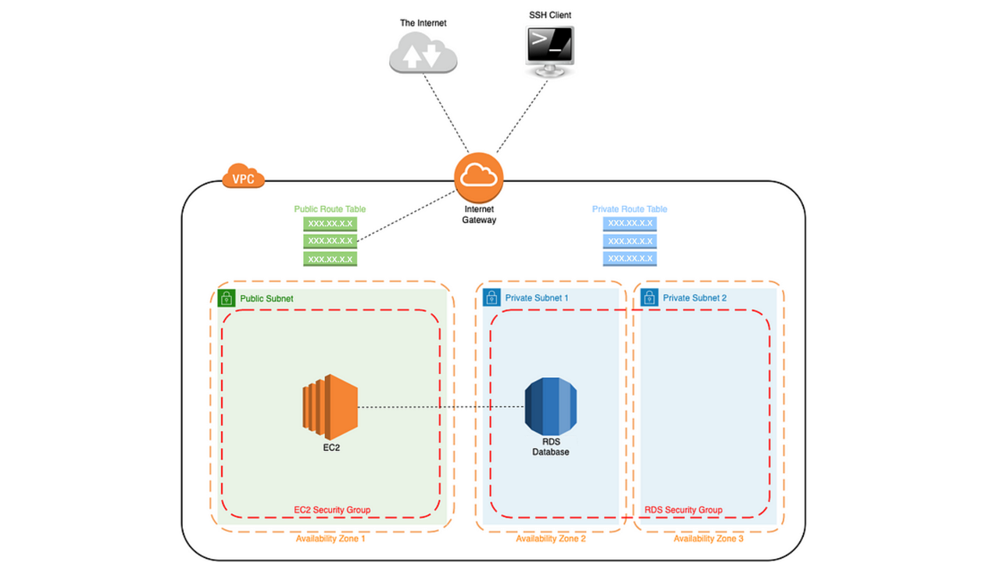
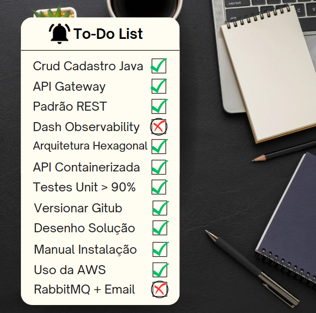
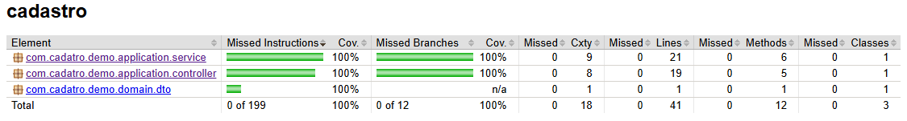

📌 Cadastro API

🚀 Cadastro API é uma API RESTful desenvolvida em Java (Spring Boot) que permite o cadastro de usuários, consulta de registros e envio de notificações por e-mail. A aplicação segue arquitetura hexagonal e é conteinerizada, permitindo fácil escalabilidade.

✨  

Funcionalidades

 
🚀 Tecnologias Utilizadas
- Spring Boot (Framework principal)
- Spring Data JPA (Banco de dados PostgreSQL)
- JUnit + Mockito (Testes unitários)
- Docker (Containerização)
- Kubernetes (Orquestração)
- Terraform (Infraestrutura como código)
- AWS (Hospedagem e serviços cloud)

🔧 Pré-requisitos
Antes de iniciar, certifique-se de ter instalado:
- Java 17+
- Docker e Docker Compose
- Kubernetes (kubectl + minikube)
- Terraform (para provisionamento)
- PostgreSQL (Banco de dados)

🛠 Endpoints da API
Cadastro 
✅ POST /cadastros → Criação de cadastro 
✅ GET /cadastros/{id} → Consulta por ID 
✅ GET /cadastros → Listagem de cadastros 
✅ PATCH /cadastros/{id} → Atualização parcial 
✅ DELETE /cadastros/{id} → Exclusão  
Exemplo de requisição:
POST /cadastros
{
"nome": "Eduardo",
"sobrenome": "Gavioli",
"idade": 30,
"pais": "Brasil"
}

✅ Testes
Para rodar os testes unitários:
mvn test

✅ Cobertura de testes esperada: > 90%+ 🛡️

📦 Estrutura do Projeto 
cadastro-api/ 
├── src/main/java/com/example/cadastro/ 
│   ├── domain/       # Entidades e regras de negócio 
│   ├── application/  # Controllers  
│   ├── infrastructure/  # Banco de Dados, Mensageria 
├── docker/ 
├── infra/ 
├── README.md 
├── pom.xml 

🏗 Deploy AWS via Terraform 
Para provisionar a infraestrutura: 
cd terraform 
terraform init 
terraform apply 

Isso criará uma instancia EC2, RDS (PostgreSQL) e API Gateway na AWS.

📜 Instalação 
1️⃣ Clone o repositório 
git clone https://github.com/eduardo-gavioli/cadastro-case.git 
cd cadastro-case 
-   Abra em uma IDE de preferencia 
instale todas as dependencias MAVEN. 
-   Ir na pasta principal da aplicação e executar 
    .\mvnw install 
    mvn clean package install -U  

-  ⚠️Certifique-se que o docker esteja iniciado em sua maquina

2️⃣ Configurar variáveis de ambiente 
Edite o arquivo application.properties e arquivos app_env/.env e docker_env/.env 
- Após, rode para gerar a imagem localmente (esta imagem que será executada na aws pelo arquiv user_data.sh dentro da pasta infra) 
docker build . -t userDockerHub/public-api:latest 

⚠️ Para subir no docker hub 
docker push userDockerHub/public-api:latest

3️⃣ Se informar que você não está logado para enviar a imagem para o dockerhub, execute 
docker login 

4️⃣ para verificar se a imagem está funcionando ou não  
docker run -p 8080:8090 userDockerHub/public-api:latest 

⚠️ Estando tudo certo execute para rodar o container local 
docker-compose up -d 

-   AWS 
1️⃣  Para criar a infra (IaC) na aws, acesse a pasta infra dentro da raiz do projeto e execute. 
terraform apply
 
- Após a criação da infra será mostrado no prompt o dns publico, ip publico e url do banco de dados postgres.

